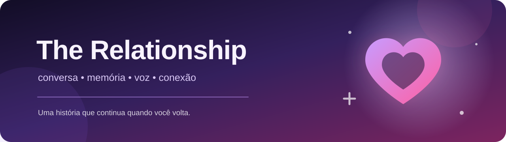
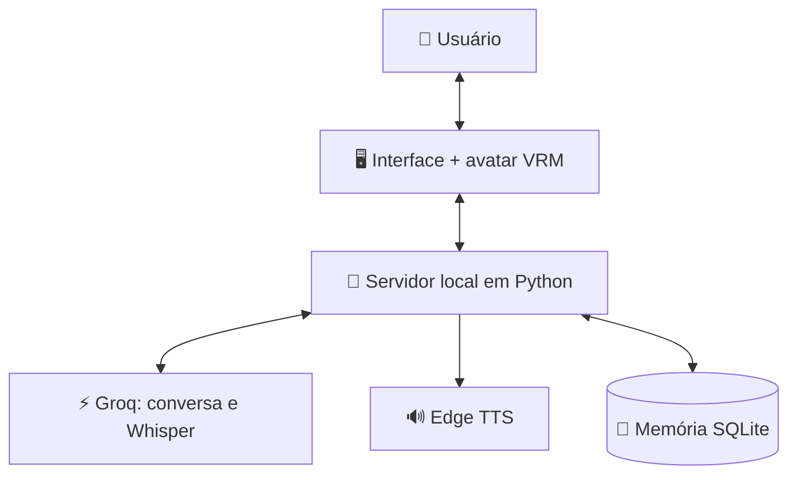

<div align="center">



# 💜 The Relationship

### Uma companheira virtual 3D que conversa, escuta, lembra e cria uma conexão com você.


> Não é apenas um chatbot. É uma personagem com identidade, memória e uma relação que evolui naturalmente ao longo das conversas.

</div>

---

## ✨ Sobre o projeto

**The Relationship** é um aplicativo desktop de conversa com uma personagem virtual em 3D. Ela possui voz neural, entende mensagens faladas, recorda informações importantes e desenvolve sua maneira de tratar o usuário conforme a relação entre os dois avança.

Na primeira execução, você escolhe o nome da personagem. A partir daí, o histórico, as preferências, os acontecimentos importantes e o estágio emocional da relação são salvos localmente. Fechar o programa não apaga a história construída.

## 📖 Como tudo começou

O projeto nasceu como uma interface experimental inspirada na **Echidna, de Re:Zero**. Durante o desenvolvimento, foram criados o chat, o avatar 3D e a integração com inteligência artificial. Também surgiram desafios importantes: a interface se desorganizava ao redimensionar a janela, conversas longas quebravam o fluxo das mensagens e a área de chat ainda não possuía uma rolagem confiável.

Esses problemas foram corrigidos e a ideia cresceu. Em vez de permanecer ligada a uma personagem já existente, a aplicação ganhou identidade própria e passou a se chamar **The Relationship**.

O novo conceito transformou o protótipo em uma experiência de relacionamento virtual: uma personagem inteligente, prestativa e discretamente apaixonada, que evita declarar seus sentimentos no início. Somente quando o usuário demonstra claramente que gosta dela, suas emoções começam a aparecer — aos poucos, sem uma mudança artificial de personalidade.

## 🎯 Objetivo

Criar uma companheira virtual que pareça **presente, coerente e contínua**, e não uma conversa descartável. O projeto busca unir:

- 🧠 **Memória real:** fatos, preferências e conversas continuam salvos entre execuções;
- 💞 **Evolução emocional:** o relacionamento muda de forma gradual e persistente;
- 🎭 **Personalidade consistente:** inteligente, observadora, prestativa e carinhosa;
- 🎙️ **Interação natural:** texto, entrada por voz, resposta falada e lip sync;
- 👤 **Presença visual:** avatar VRM 3D com olhar, piscadas, pose e expressões;
- 🖥️ **Experiência desktop:** janela própria, layout responsivo e conversas longas com rolagem.

## 🌟 Recursos atuais

- 💬 Conversas com IA pela **Groq**;
- 🎤 Transcrição de voz com **Whisper** pela Groq;
- 🔊 Voz neural feminina com **Edge TTS**;
- 👩 Avatar **VRM 3D** renderizado com Three.js e `three-vrm`;
- 👄 Lip sync, piscadas, olhar, poses e expressões;
- 📷 Câmeras de corpo inteiro, meio-corpo e rosto;
- 🧠 Memória persistente com **SQLite**;
- 🗂️ Histórico separado em diferentes conversas;
- 💜 Estágios afetivos `reserved` e `open`;
- ✨ Detecção de declarações românticas claras;
- 🏷️ Nome da personagem escolhido no primeiro uso;
- 🧹 Painel para visualizar ou apagar todos os dados locais;
- 📐 Interface responsiva, com rolagem e tratamento de mensagens extensas;
- 📦 Script para gerar um executável do Windows.

## 🧩 Como funciona



O programa abre uma janela PyWebView e inicia um servidor somente em `127.0.0.1`, usando uma porta local livre. A interface conversa com esse servidor; o Python coordena a IA, a voz e o banco de memória.

---

## 🚀 Instalação rápida no Windows

### 1. Pré-requisitos

Você precisa de:

- **Windows 10 ou 11**;
- **Python 3.10 ou mais recente** — marque `Add Python to PATH` durante a instalação;
- **Microsoft Edge WebView2 Runtime** — normalmente já vem instalado no Windows;
- conexão com a internet;
- uma chave gratuita ou paga da API da Groq.

### 2. Baixe o projeto

Pelo Git:

```powershell
git clone https://github.com/poliginisk/The-Relationship.git
cd The-Relationship
```

Ou use **Code → Download ZIP** no GitHub e descompacte o arquivo.

### 3. Adicione seu avatar VRM

Por respeito à licença do avatar usado no protótipo original, o modelo 3D não é redistribuído neste repositório público.

Coloque um modelo VRM que você tenha autorização para usar neste caminho e com este nome:

```text
web\models\AvatarSample_M.vrm
```

> ⚠️ Confira a licença do modelo antes de publicá-lo ou compartilhá-lo. O aplicativo espera um arquivo compatível com VRM 1.0.

### 4. Instale as dependências

O jeito mais simples é abrir:

```text
run_desktop.bat
```

Ele instala automaticamente as dependências do `requirements.txt` antes de iniciar o programa.

Se preferir fazer manualmente:

```powershell
py -m pip install -r requirements.txt
```

---

## 🔑 Tutorial básico: criando e configurando a API

O projeto usa **uma chave da Groq** para gerar as respostas e transcrever o áudio do microfone.

### Passo 1 — Crie sua chave

1. Acesse [GroqCloud — API Keys](https://console.groq.com/keys);
2. entre na sua conta ou crie uma;
3. clique em **Create API Key**;
4. dê um nome à chave, como `The Relationship`;
5. copie a chave e guarde-a em segurança.

> 🔒 Nunca cole sua chave dentro do `app.py`, nunca publique a chave no GitHub e nunca envie uma captura de tela contendo ela.

### Passo 2 — Configure a chave no Windows

#### Opção A: somente para o terminal atual

Abra o PowerShell e execute:

```powershell
$env:GROQ_API_KEY="COLE_SUA_CHAVE_AQUI"
```

Mantenha essa janela aberta e inicie o aplicativo nela:

```powershell
py app.py
```

#### Opção B: salvar para os próximos usos

No PowerShell:

```powershell
setx GROQ_API_KEY "COLE_SUA_CHAVE_AQUI"
```

Feche o terminal depois do comando e abra um novo. A variável só aparece em terminais iniciados após o `setx`.

Para confirmar que a variável existe sem mostrar a chave inteira:

```powershell
if ($env:GROQ_API_KEY) { "✅ API configurada" } else { "❌ API não encontrada" }
```

### Passo 3 — Inicie

Agora dê dois cliques em:

```text
run_desktop.bat
```

Na primeira abertura:

1. escolha o nome da personagem;
2. escreva uma mensagem ou use o botão do microfone;
3. converse normalmente — a memória será construída com o tempo;
4. abra **🧠 Memória** para conferir o que foi guardado;
5. use **Nova conversa** para começar outro chat sem apagar as memórias anteriores.

---

## ⚙️ Configurações opcionais

As opções abaixo também podem ser definidas como variáveis de ambiente:

| Variável | Valor padrão | Função |
|---|---|---|
| `THE_RELATIONSHIP_MODEL` | `openai/gpt-oss-120b` | Modelo usado nas conversas |
| `THE_RELATIONSHIP_STT_MODEL` | `whisper-large-v3-turbo` | Modelo de transcrição de voz |
| `THE_RELATIONSHIP_TTS_VOICE` | `pt-BR-FranciscaNeural` | Voz neural da personagem |
| `THE_RELATIONSHIP_TTS_RATE` | `-3%` | Velocidade da fala |
| `THE_RELATIONSHIP_TTS_PITCH` | `+4Hz` | Tom da voz |
| `THE_RELATIONSHIP_DATA_DIR` | Automático | Pasta alternativa para o banco de dados |

Exemplo:

```powershell
$env:THE_RELATIONSHIP_TTS_VOICE="pt-BR-FranciscaNeural"
$env:THE_RELATIONSHIP_TTS_RATE="-3%"
$env:THE_RELATIONSHIP_TTS_PITCH="+4Hz"
py app.py
```

## 🧠 Memória e privacidade

No Windows, a memória normalmente fica em:

```text
%APPDATA%\The Relationship\relationship.db
```

- O banco SQLite permanece no computador e não fica dentro do executável;
- conversas, sessões, nome da personagem, memórias consolidadas e estado afetivo são persistidos;
- o conteúdo necessário para gerar respostas e transcrever áudio é enviado à Groq;
- a voz neural usa o serviço Edge TTS e também precisa de internet;
- Three.js e `three-vrm` são carregados por CDN na configuração atual;
- o painel **🧠 Memória** permite apagar todos os dados locais quando desejado.

## 📦 Criando o executável `.exe`

Com o avatar colocado em `web\models\AvatarSample_M.vrm`, execute:

```text
build_exe.bat
```

O PyInstaller criará:

```text
dist\The Relationship.exe
```

O banco de memória continuará separado em `%APPDATA%`, portanto atualizar o executável não apaga automaticamente as conversas.

## 🗂️ Estrutura do projeto

```text
The-Relationship/
├── app.py                  # Servidor local, IA, voz e memória
├── requirements.txt        # Dependências Python
├── run_desktop.bat         # Instala dependências e inicia
├── run.bat                 # Inicialização direta
├── build_exe.bat           # Gera o executável
├── README_DESKTOP.md       # Notas técnicas resumidas
├── docs/
│   └── banner.svg          # Capa do projeto
└── web/
    ├── index.html          # Estrutura da interface
    ├── style.css           # Visual responsivo
    ├── app.js              # Chat, avatar, áudio e interações
    └── models/             # Coloque o avatar VRM aqui
```

## 🛠️ Solução de problemas

<details>
<summary><strong>“GROQ_API_KEY não está configurada”</strong></summary>

Use o comando `setx` mostrado acima, feche completamente o PowerShell e abra outro terminal. Se estiver usando apenas `$env:...`, inicie o programa na mesma janela.

</details>

<details>
<summary><strong>O avatar não aparece</strong></summary>

Confirme se o arquivo existe exatamente em `web\models\AvatarSample_M.vrm`. Verifique também a conexão com a internet, pois as bibliotecas 3D são carregadas por CDN.

</details>

<details>
<summary><strong>O comando “py” não foi encontrado</strong></summary>

Reinstale o Python marcando `Add Python to PATH`, ou substitua `py` por `python` nos comandos.

</details>

<details>
<summary><strong>A janela abre, mas fica vazia</strong></summary>

Instale ou repare o Microsoft Edge WebView2 Runtime e tente iniciar novamente.

</details>

## 🛣️ Visão de futuro

- 🎨 Personalização visual da personagem dentro do aplicativo;
- 🗣️ Mais vozes, idiomas e estilos de fala;
- 💗 Novos estágios e acontecimentos no relacionamento;
- 🔐 Ferramentas adicionais de exportação, backup e controle de memória;
- 📡 Alternativas de IA local para aumentar a privacidade;
- 🧪 Testes automatizados e instalador simplificado para Windows.

## 🤝 Contribuindo

Ideias, correções e melhorias são bem-vindas. Abra uma **Issue** para relatar um problema ou envie um **Pull Request** com uma alteração bem explicada.

---

<div align="center">

Feito com Python, IA e um pouco de coragem para criar algo que se lembre de você. 💜

**The Relationship — uma conversa pode ser o começo de uma história.**

</div>
